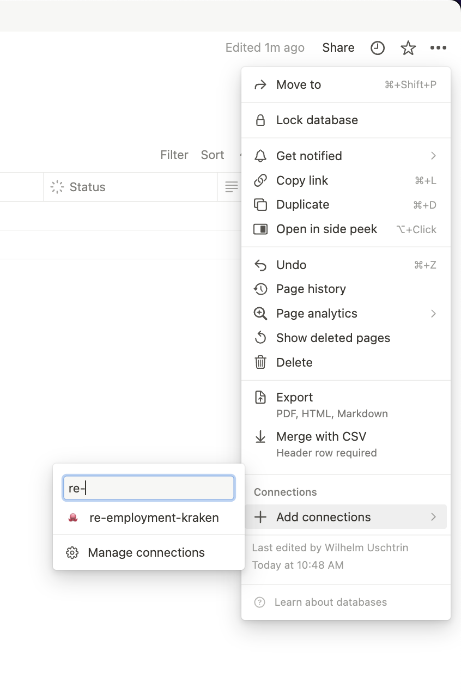

# How-To: Setting up the Notion Integration

You will need to take the following 5 steps to have `re-employment-kraken` insert new sightings on a Notion board for you.

1. **Create the board where you want the cards to appear**
2. **Configure the board**
3. **Create an integration on the Notion workspace for `re-employment-kraken`**
4. **Add `re-employment-kraken` to the board**
5. **Add the board id and the authentication token to the `.env` file and enable Notion as a notification strategy**

Let's walk through each of these in detail.

Note:

- Whenever I write 'board' or 'database', for our purpose, these are pretty much the same thing in Notion.
- Notion sometimes calls 'integrations' 'connections', these terms mean the same thing.

## 1. Create the Board

Creation of a board itself should be self-explanatory. But you also need to copy the board id, which you can by copying the page link from the sharing options to the upper right corner of the UI.

The schema should look something like this:

```bash
https://www.notion.so/WORKSPACE_NAME/BOARD_ID?v=SOME_OTHER_STRING&pvs=SOME_INTEGER
```

So the board id is that first longish random string after your workspace name. Copy and paste it somewhere safe for now, you'll need it later.

## 2. Configure the Board

When creating entries in the Notion database via the API, Notion expects the database schema and the properties of the new entry to match.

Therefore you will need to configure your Notion database to have the following properties (actually you are configuring the properties on the entries):

|Name|Type|Comment
|:-:|:-:|:-:|
|Status|Status|Be sure that there is a status called 'Not started'|
|Href|URL||
|Strategy|Text||
|Query|Text||

The 'Status' field should already be there if you initialized the database as a board.

## 3. Create an Integration

Go [here][create-notion-integration]. This should directly take you to the page to create an integration. Follow the steps, choose a cute logo and be sure to copy the integration secret that you are shown. The permissions should be set up correcly from the get-go (read/write).

I repeat: don't forget to copy the integration secret aka 'authentication token'.

## 4. Add `re-employment-kraken` to the Board

Go pack to your Notion board and click the 3 little dots in the the upper right corner of the page(!) to open the options. Make sure you are viewing the options of the page itself, not the board's.

Then click 'Add connection' and add your integration.

Here is a screenshot:



## 5. Enable Notion as a Notification Strategy

Open your `.env` file, set `NOTION_BOARD_ID` and `NOTION_AUTH_TOKEN` using the values you copied before and flip `NOTION_ENABLED` to `"true"`.

That's it, you're done. `re-employment-kraken` should now create entries on your Notion board.

Feel free to add more properties to your database/entries via the UI and create as many different status columns as you need for your process/funnel.

<!-- Links -->

[create-notion-integration]: https://www.notion.so/my-integrations
